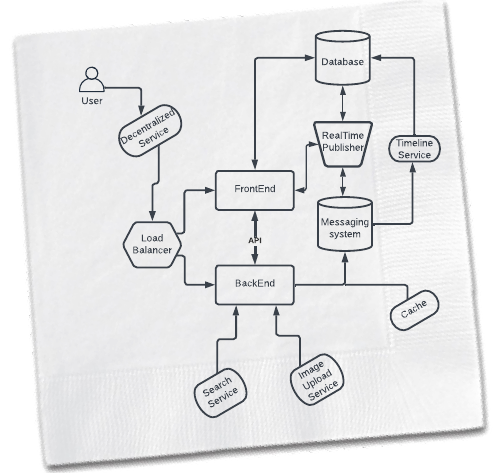
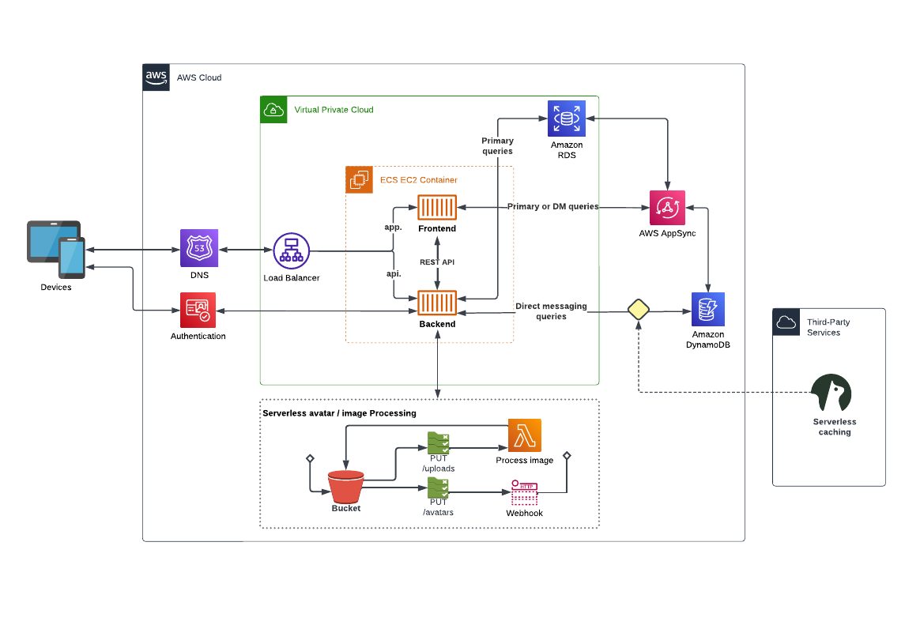

# Week 0 — Billing and Architecture
## Architecture Diagrams:

- Conceptual Diagram:

- Logical Diagram:

## Checklist
- [x] Watched Week 0 - Live Streamed Video	https://www.youtube.com/watch?v=SG8blanhAOg&list=PLBfufR7vyJJ7k25byhRXJldB5AiwgNnWv&index=12
- [x] Watched Chirag's Week 0 - Spend Considerations	https://www.youtube.com/watch?v=OVw3RrlP-sI&list=PLBfufR7vyJJ7k25byhRXJldB5AiwgNnWv&index=13
- [x] Watched Ashish's Week 0 - Security Considerations	https://www.youtube.com/watch?v=4EMWBYVggQI&list=PLBfufR7vyJJ7k25byhRXJldB5AiwgNnWv&index=15
- [x] Recreate Conceptual Diagram in Lucid Charts or on a Napkin	https://www.youtube.com/watch?v=K6FDrI_tz0k&list=PLBfufR7vyJJ7k25byhRXJldB5AiwgNnWv&index=17
- [x] Recreate Logical Architectual Diagram in Lucid Charts	https://www.youtube.com/watch?v=K6FDrI_tz0k&list=PLBfufR7vyJJ7k25byhRXJldB5AiwgNnWv&index=17
- [x] Create an Admin User	https://www.youtube.com/watch?v=OdUnNuKylHg&list=PLBfufR7vyJJ7k25byhRXJldB5AiwgNnWv&index=14
- [x] Use CloudShell	https://www.youtube.com/watch?v=OdUnNuKylHg&list=PLBfufR7vyJJ7k25byhRXJldB5AiwgNnWv&index=14
- [x] Generate AWS Credentials	https://www.youtube.com/watch?v=OdUnNuKylHg&list=PLBfufR7vyJJ7k25byhRXJldB5AiwgNnWv&index=14
- [x] Installed AWS CLI	https://www.youtube.com/watch?v=OdUnNuKylHg&list=PLBfufR7vyJJ7k25byhRXJldB5AiwgNnWv&index=14
- [x] Create a Billing Alarm	https://www.youtube.com/watch?v=OdUnNuKylHg&list=PLBfufR7vyJJ7k25byhRXJldB5AiwgNnWv&index=14
- [x] Create a Budget	https://www.youtube.com/watch?v=OdUnNuKylHg&list=PLBfufR7vyJJ7k25byhRXJldB5AiwgNnWv&index=14
